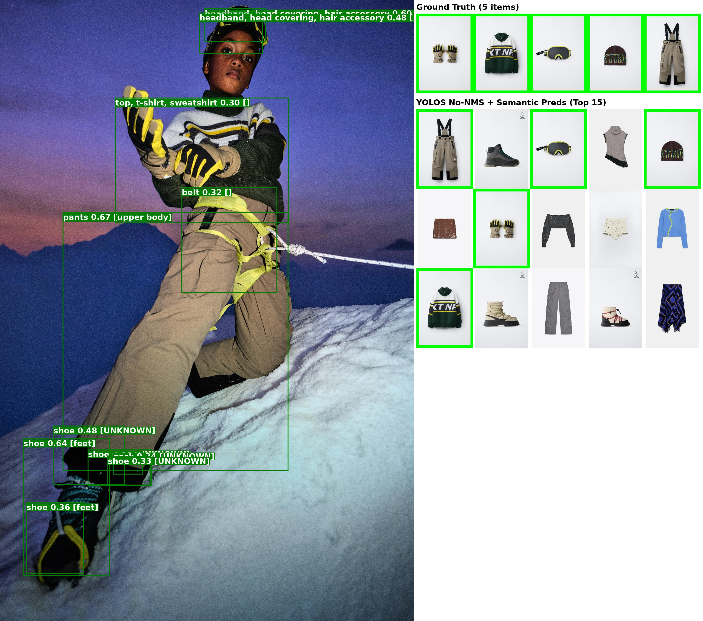
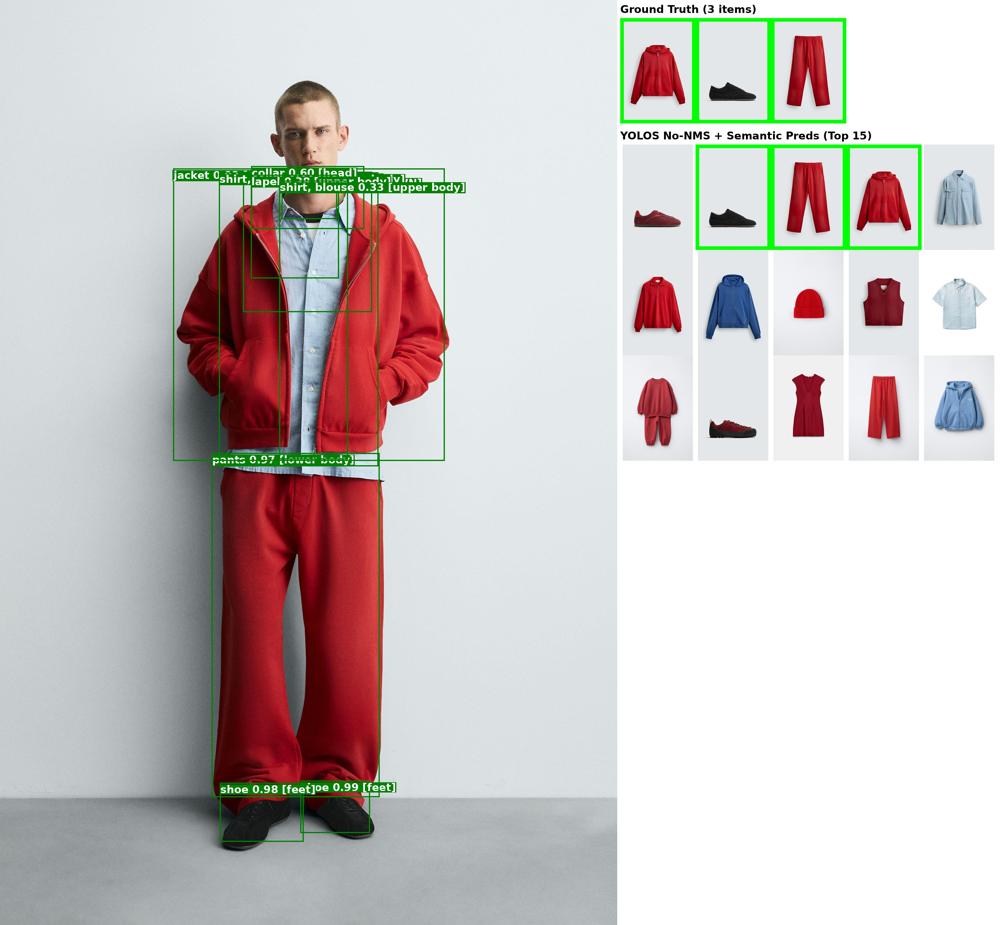
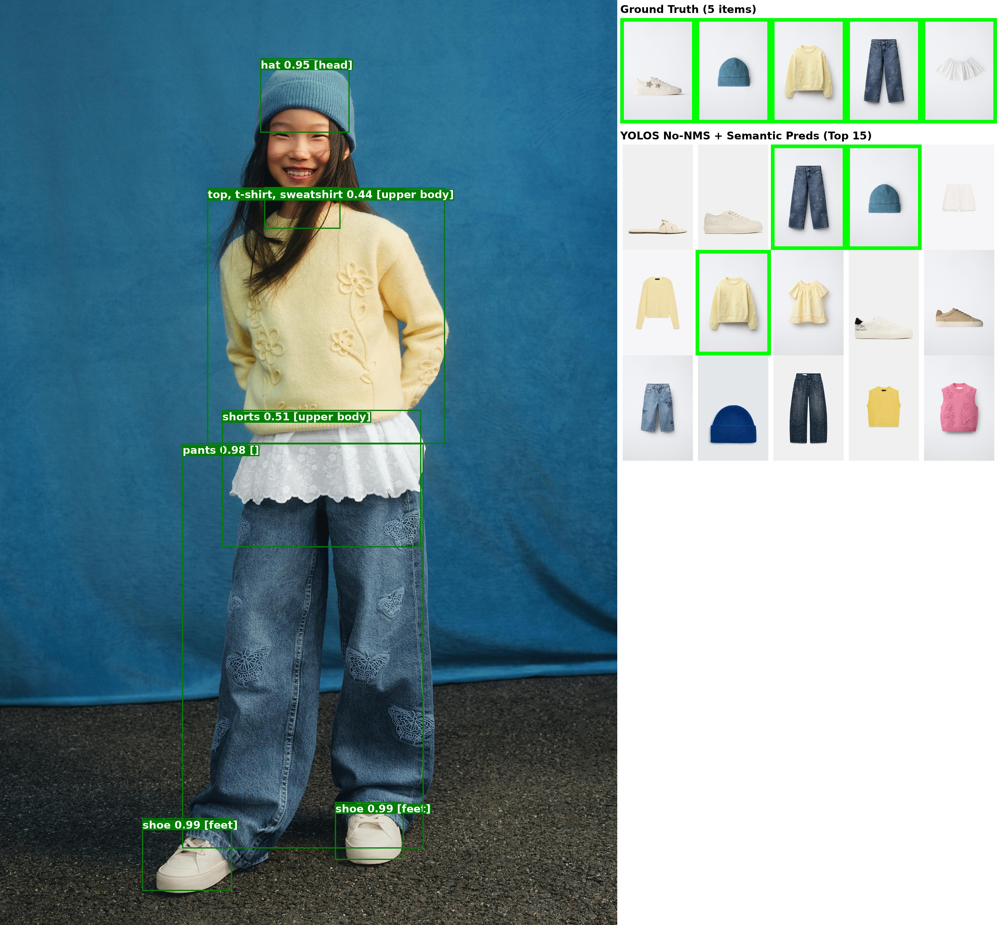
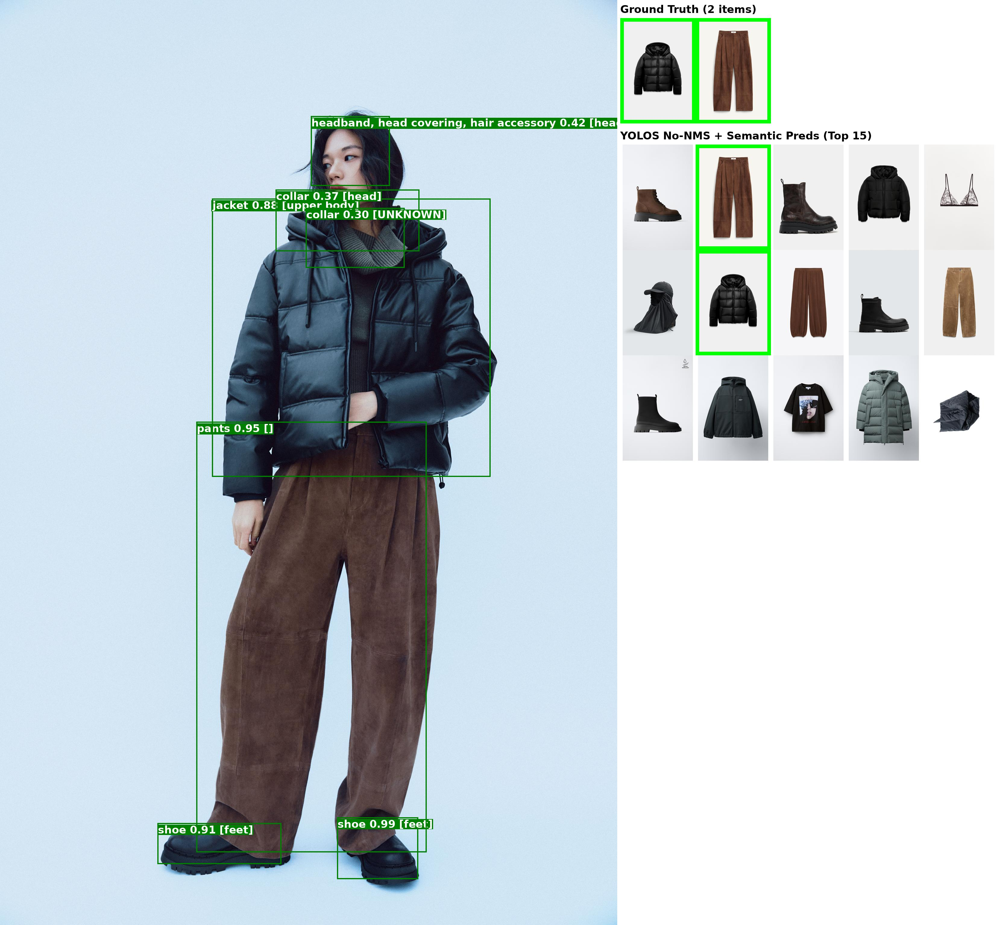
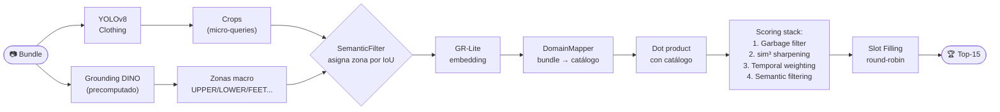
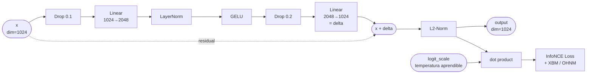
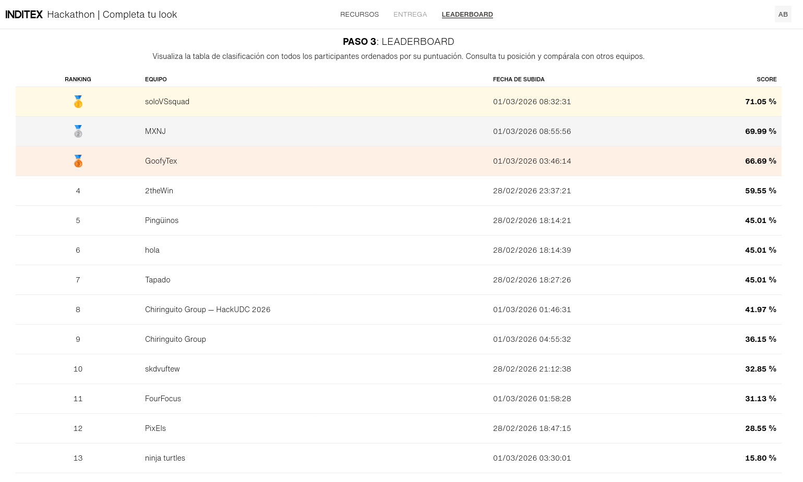

# Inditex Fashion Retrieval - HackUDC 2026 - Repositorio ganador


> **Reto de Zara / Inditex**: Desarrollar una solución que, a partir de una foto de un modelo, identifique los artículos que lleva puestos (como un vestido, tacones, collar, o bolsa) y, para cada uno de ellos, devuelva la referencia del producto correspondiente de un catálogo predefinido. 
> 
> Ver detalles en [docs/RETO.md](docs/RETO.md), o [en el sitio web del HackUDC 2026](https://live.hackudc.gpul.org/challenges/).

> [!TIP] 
> 🌐 [English version](docs/README_EN.md) and [spanish PDF of the readme](docs/README.pdf) available in [docs/](docs/)

---

> [!NOTE]
> Este fue el repositorio ganador del Hackathon Inditex Fashion Retrieval en el HackUDC 2026. Participé como _soloVSsquad_ y obtuve una puntuación final del **71.05%** (calculada como el porcentaje de líneas correctas de la submission sobre la ground truth).

---

| | |
|:---:|:---:|
|  |  |
|  |  |


> [!WARNING]
> **Este repo fue vibecodeado en un hackathon, con 3 horas de sueño, en un lapso de 36 horas.** El código funciona, pero no está organizado para producción. Y no es bonito. De hecho, es feo.
>
> El historial de git es cuestionable ya que tuve que reiniciarlo a partir de un zip de una versión anterior (problemas con historial al commitear sin querer archivos grandes de embeddings precomputados).
> La estructura y abstracción de código es cuestionable y casi todo está estructurado en scripts en lugar de clases y bastante duplicación de código. Hay muchas decisiones cuestionables tomadas a las 5 de la madrugada. Estás avisado. Lo refinaré cuando pueda, pero funciona para el objetivo que tiene, siguiendo las instrucciones [del setup](#setup).

---

## ¿Qué hace esto?

Dada una foto de "bundle" (outfit, modelo en la calle, campaña de ropa), localizamos cada prenda y buscamos los 15 productos más parecidos del catálogo de Inditex. La métrica es **Recall@15**.


Traté el reto como un **problema de búsqueda / recuperación de información** (Information Retrieval), no como un problema de clasificación, generación, o finetuning / reentrenamiento pesado. La pregunta clave es: *¿cómo encontrar, dentro de un catálogo de miles de productos, los 15 más similares a una prenda detectada en una foto de campaña, **de modo que se pueda iterar rápidamente sobre la solución**?*

Esto se reduce a obtener queries (crops de prendas) y calcular la similitud de embeddings en un espacio vectorial, pero con varias fuentes de ruido que hay que corregir:

1. **Domain gap**: Las fotos de bundle (modelos en campaña) tienen un estilo visual muy distinto a las fotos de producto del catálogo (fondo blanco, iluminación estudio). Un mismo artículo genera embeddings diferentes en cada dominio → el `DomainMapper` lo corrige sin reentrenar el backbone.
2. **Reparto de presupuesto de predicciones**: El sistema evalúa hasta 15 productos por bundle. Si hay 3 prendas en el outfit, lo más intuitivo sería dar 5 predicciones a cada una. El _Slot Filling_ con round-robin distribuye esto equitativamente entre todas las queries detectadas.
3. **Calidad de la query (crop)**: No todos los recortes de YOLO son igualmente buenos. Hay recortes de fondo, de detalles irrelevantes, etc. El _garbage filter_ y la contextualización global sirven de guardrail.

La filosofía fue: **evitar finetunings o reentrenamientos pesados del backbone** (que consumen mucho tiempo y GPU) y en cambio **concentrar las mejoras en la lógica intermedia**: mejor mapeo de dominio, mejor selección de negativos en el entrenamiento del mapper, y mejor reparto e interpretación de las predicciones.

Las mejoras incrementales que más puntuaron vinieron casi todas de progresar el **DomainMapper** con técnicas de aprendizaje contrastivo más ricas (especialmente en el minado de negativos). También el **slot filling** fue clave para no desperdiciar el presupuesto de 15 predicciones en una sola prenda que era más similar, y la mejora en detección de prendas con YOLOv8-Clothing fue clave para tener buenas "queries" de entrada al sistema.

---

## Archivos principales

Aquí tienes un mapa rápido de lo que hace cada script, ya que la estructura en sí es un poco caótica. Si quieres pasar directamente a probarlo, tendrás que conseguir datos (creo que los de la competición no son públicos) y estructurarlos, y luego salta a [setup](#setup). Si quieres un resumen más visual, echa un vistazo a la [pipeline de funcionamiento](#pipeline-de-funcionamiento).

| Archivo | Descripción |
|---|---|
| `run_submission.py` | **El script principal de inferencia.** Orquesta todo el pipeline de extremo a extremo: carga modelos, itera sobre los bundles de test, extrae crops con YOLO, genera embeddings con GR-Lite, aplica el DomainMapper sobre estos, calcula similitudes, aplica filtros (temporal, semántico, garbage) y genera el CSV de submission mediante Slot Filling (round-robin). Todo esto lo hace apoyándose en archivos precomputados previamente para poder iterar rápido entre submission y submission. |
| `train_mapper.py` | **El corazón del proyecto.** Define y entrena el `SuperDomainMapper`, una red neuronal ligera que corrige el domain gap bundle→catálogo. Contiene la arquitectura del mapper (residual + temperatura aprendible), las funciones de pérdida (InfoNCE con Hard Negative Mining, y la versión con Cross-Batch Memory que fue la usada en la submission ganadora), y el loop de entrenamiento completo con MixUp, SWA y OneCycleLR. La mejora iterativa de este módulo fue lo que más impactó en la puntuación final. |
| `run_gr_lite.py` | Utilidades para cargar el modelo GR-Lite (backbone DINOv3 fine-tuneado para moda) y precomputar los embeddings de todo el catálogo. También sirve como baseline naive (nearest neighbor sin mapper) y contiene `get_embeddings()`, función reutilizada por otros scripts. Importante destacar que el finetune no tiene config en el repo, por lo que los pesos se cargan sobre la config de DinoV3. |
| `compare_models.py` | Script del **Slot Filling Router**: combina las detecciones de tres modelos (Grounding DINO + YOLOS-Fashionpedia + YOLOv8) y las enruta a slots semánticos (`UPPER`, `LOWER`, `SHOES`, `DEFAULT`) usando un sistema de votación con IoU. Fue un experimento para ver si combinar detectores mejoraba los crops; al final el pipeline principal usa solo YOLOv8 finetuneado sobre 4 categorías de fashionpedia (clothing, shoes, bags, accessories). Es posible que mejorando esto mejore mucho el sistema. |
| `semantic_filtering.py` | Define la clase `SemanticFilter`. Sus responsabilidades son: (1) precomputar metadata semántica del catálogo (zona corporal de cada producto por su descripción textual: `UPPER`, `LOWER`, `FEET`, etc.), (2) asignar zonas corporales a cada crop de YOLO usando las cajas macro de DINO (por IoU), y (3) aplicar filtros de similitud suaves (penalización por sección) y duros (zeroing por zona corporal contradictoria). Es buen guardrail pero a nivel de puntuación no aportó tanto. |
| `precompute_dino.py` | Ejecuta Grounding DINO sobre los bundles de test para detectar regiones "macro" del cuerpo (`upper body`, `lower body`, `feet`, `head`, `bag`) y guarda los resultados en `test_dino_macro.json`. Se ejecuta una sola vez offline porque DINO es lento. Estas cajas macro son usadas por `SemanticFilter` para contextualizar los crops de YOLO. |
| `train_lora.py` | Fine-tuning LoRA del backbone GR-Lite directamente sobre pares bundle↔producto, con Gradient Checkpointing y Gradient Accumulation para no saturar la GPU ya que estaba ejecutando en remoto, y un OOM sería GG para mí en el hackathon. Experimento que **no mejoró** en la práctica: el mapper fue más eficiente en tiempo y resultados. De todos modos, solo lo entrené con 4 epochs así que igual iterar sobre esto mejoraría. |
| `visual_prediction_debug.py` | Herramienta de visualización del pipeline de detección. Dado un bundle, dibuja los crops de YOLO, las zonas asignadas, y las 15 predicciones del catálogo más similares junto a la ground truth. Muy útil para entender por qué el modelo falla o acierta en casos concretos. |
| `download_images.py` | Script one-shot para descargar todas las imágenes de producto desde las URLs CDN del CSV del dataset. Necesario para construir el catálogo local en la primera ejecución. Por supuesto depende de que tengas los CSV de la competición... o de que los obtengas por otros medios. |
| `prompt_dinov2.txt` | Lista de descripciones de zonas corporales (head, neck, shoes, top garment...) usada como prompt de texto para Grounding DINO. Permite que DINO detecte zonas generales sobre las que refinar con YOLO. |
| `requirements.txt` | Dependencias del proyecto. Típicas dependencias de IA. |
| `LICENSE.md` | Apache 2.0. |

---

## Setup

> Aviso!! He refactorizado el código para que sea pero no he tenido tiempo de probarlo, puede que haya algún fallo pero debería ser facil de arreglar.

```bash
python -m venv .venv && source .venv/bin/activate
pip install -r requirements.txt
# Necesitas un HF_TOKEN en .env para GR-Lite
echo "HF_TOKEN=hf_..." > .env
```

```bash
# Descargar imagenes la primera vez a partir de los csv de competición
# desgraciadamente creo que no son open source, quizás tengas que scrappear
# mira en docs/csv-format-samples/ para el formato de csvs
python download_images.py

# Precomputar embeddings del catálogo (una vez)
python run_gr_lite.py

# Precomputar cajas DINO para test (una vez)
python precompute_dino.py

# Entrenar el Domain Mapper (opcional, mejora resultados)
python train_mapper.py

# Generar submission
python run_submission.py

# Para visualizar predicciones de un bundle en particular
python visual_prediction_debug.py

# Y para ver detecciones y su agregacion con el slot filling router
python compare_models.py
```

Si no tienes los datos, quizás te interese scrappearlos... Siempre respetando los términos de servicio de la web y rate limits, claro. En [docs/csv-format-samples/](docs/csv-format-samples/) tienes un ejemplo de cómo son los csv de competición.

---

## Pipeline de funcionamiento

El pipeline sigue un diseño orientado a búsqueda. Cada bundle es una "consulta", cada crop detectado es una "sub-consulta", y el catálogo es el "índice" sobre el que buscamos (si no se rendiza el diagrama, puedes verlo en [docs/pipeline.png](docs/pipeline.png)):



### Por qué este diseño

**YOLOv8 para los crops**: Decidí no hacer embedding del bundle entero (que sería una query muy ruidosa con múltiples prendas mezcladas). En su lugar, cada prenda detectada se convierte en una query independiente. Esto mejora la precisión del embedding porque GR-Lite puede "enfocarse" en una sola prenda a la vez. El coste es que ahora el presupuesto de 15 predicciones hay que repartirlo entre varias queries. Sigue habiendo un fallback a un embedding global del bundle si se detectan menos de 3 prendas.

**GR-Lite como backbone**: GR-Lite (DINOv3 fine-tuneado en fashion por terceros) fue elegido frente a CLIP porque genera embeddings mucho más discriminativos para ropa, CLIP es generalista y no distingue bien entre, por ejemplo, un jersey negro y otro jersey negro. Los embeddings de GR-Lite capturan textura, corte, color y estilo con mucha más precisión. Es el estado del arte actual (literalmente salió como una semana antes del hackathon).

**DomainMapper en lugar de finetuning**: Fine-tunear GR-Lite completo sería costoso (1.2 GB de pesos, horas por epoch en una 3090). El mapper es una red de dos capas (~4M parámetros) que se entrena en minutos y proyecta los embeddings de bundle al espacio de los embeddings de catálogo, cerrando el domain gap. Es la decisión técnica más importante del proyecto.

**Por qué DINO para las cajas macro**: YOLO detecta bien las prendas individuales (micro-crops), pero no sabe si una manga larga es "upper body" o si unas zapatillas son "feet". Grounding DINO con un prompt de texto (`"upper body. lower body. feet. head. bag."`) identifica regiones corporales y permite asignar una zona semántica a cada crop de YOLO por intersección (IoU).

**Scoring stack**: La similaridad coseno cruda no es perfecta. En teoría, el cubo (`sim^3`) amplifica la diferencia entre el top-1 seguro y los candidatos mediocres aunque esto tuvo poco impacto según mis experimentos. El filtro temporal en cambio sumó unos sólidos 2-3 puntos de recall (gracias a Sergio de goofyTex por decírmelo) y explota el hecho de que los timestamps en las URLs de Inditex correlacionan con la colección, y las prendas de la misma colección son más probables de aparecer juntas en un bundle. El filtro semántico impide que un crop de zapatos devuelva camisetas.

**Slot Filling (round-robin)**: En lugar de dar los 15 primeros resultados de la query más confiada (que podrían ser 15 variantes del mismo producto, o de un producto muy fácil de detectar), se toma de manera rotativa 1 predicción de cada crop. Así si hay 4 prendas, las 15 predicciones finales estarán distribuidas entre todas. Esto evita desperdiciar el presupuesto de Recall@15. El problema es que si una prenda no es la más obvia por similitud, y hay varias detecciones en el bundle, es posible que no se le de oportunidad de salir.


Esta es la arquitectura de la red neuronal del SuperDomainMapper (si no se renderiza, puedes verla en [docs/nn_arch.png](docs/nn_arch.png)):



---

## Técnicas implementadas

### 🔍 Detección de prendas

- **YOLOv8-Clothing** (`kesimeg/yolov8n-clothing-detection`): detector principal de crops. Cada crop actúa como una query de búsqueda independiente. Se usa sin NMS adicional para no perder detecciones válidas en casos de solapamiento. Se podría estudiar como incluir NMS y filtros de confianza para mejorar la calidad de los crops, pero mis pruebas no dieron mejoras significativas.
- **Global image fallback**: si YOLO detecta menos de 3 prendas (p.ej. imagen borrosa o atípica), se añade el bundle completo como query adicional para garantizar cobertura.
- **Grounding DINO** (precomputado offline en `test_dino_macro.json`): detecta regiones macro del cuerpo con un prompt de texto. No se usa directamente en inferencia (demasiado lento); se precomputa una sola vez.

### 🧠 Embeddings y Domain Mapping

- **GR-Lite** (backbone DINOv3 de Meta, fine-tuneado para moda): extractor de features visual. Genera embeddings de 1024 dimensiones. Mucho mejor que CLIP para ropa fina.
- **SuperDomainMapper** (`train_mapper.py`): red neuronal residual de dos capas con temperatura aprendible (estilo CLIP/SigLIP). Proyecta embeddings de bundle al espacio de embeddings de catálogo. Arquitectura: `Dropout(0.1) → Linear(1024, 2048) → LayerNorm → GELU → Dropout(0.2) → Linear(2048, 1024) + skip connection + L2-normalize`. Al principio era más simple y luego la refiné.
  - **Temperatura aprendible**: equivale a aprender automáticamente el factor de escala de los logits, eliminando un hiperparámetro crítico.
  - **Online Hard Negative Mining (OHNM)**: en la función de pérdida InfoNCE, en lugar de usar todos los negativos del batch se selecciona solo el top-15% más difícil. Fuerza al modelo a aprender distinciones finas entre productos similares.
  - **Cross-Batch Memory (XBM)**: banco FIFO de 8192 embeddings de producto de batches anteriores. Expande el campo de negativos efectivos de ~511 (batch) a ~8703 sin coste extra de VRAM. A más detalle, lo que hace es guardar los embeddings de los productos de batches anteriores y usarlos como negativos en la función de pérdida. Cómo sabe que son negativos? Pues porque no son el producto que se está buscando xd. Y si son muy similares a este pues mejor, porque así el modelo aprende a diferenciarlos. **Esta fue la técnica que más impacto tuvo en la puntuación final**, fue el salto definitivo al 71%.
  - **MixUp sobre embeddings**: mezclamos pares de embeddings (α=0.2, 30% de probabilidad) para regularizar el espacio y hacerlo más "transitable", evita zonas vacías y mejora la generalización.
  - **Label Smoothing** (en la pérdida XBM): sustituye los labels duros [0,1] por distribuciones suaves, evitando que el modelo colapse ante pseudo-etiquetas ruidosas. No entiendo de todo esta función pero mejora el entrenamiento.
  - **OneCycleLR**: scheduler con warmup automático (10% inicial) y cosine annealing. Estabiliza el entrenamiento y permite LRs más altos.
  - **Stochastic Weight Averaging (SWA)**: promedia los pesos del último 20% de epochs, suavizando el landscape de la pérdida y mejorando la generalización.

### 🔎 Búsqueda y scoring

- **Similarity sharpening** (`sim^3`): el cubo de las similitudes amplifica la separación entre candidatos confiados y mediocres. Seguro porque los embeddings normalizados tienen similitudes positivas en la práctica y no hay riesgo de que se vuelva negativo con el cubo. Esto no tuvo mucho impacto, lo mantuve porque fue una idea de ultima hora.
- **Garbage filter**: si el máximo de similitud de un crop con todo el catálogo es < 0.20, se descarta ese crop. Filtra recortes de fondo, elementos no-ropa (farolas, suelo) o imágenes demasiado ruidosas.
- **Temporal Proximity Weighting**: las URLs del CDN de Inditex contienen un timestamp (`ts=`) que indica la colección. Se aplica un decaimiento gaussiano (σ ≈ 1 mes) sobre la diferencia temporal entre el bundle y cada producto. Las prendas sincrónicamente cercanas reciben un bonus, las de otras colecciones una penalización. Sorprendentemente importante para la puntuación final, se siente un poco como hacer trampa pero bueno.
- **Alpha Query Expansion (AQE / α-QE)**: refina el embedding de la query promediándolo con sus K vecinos más cercanos del catálogo antes de hacer la búsqueda final. Arrastra la query hacia el centro del cluster correcto. Implementado pero **no mejoró** consistentemente en la práctica, no se usa en la submission final.

### 🗺️ Filtrado semántico

- **Semantic Filtering** (`semantic_filtering.py`): dos tipos de filtros sobre las similitudes raw:
  - *Filtro suave (× 0.7)*: si el producto y el bundle pertenecen a secciones distintas (e.g., producto de "niño" en un bundle de "mujer"), penaliza su similitud.
  - *Filtro duro (× 0.0)*: si la zona corporal del crop (UPPER, LOWER, FEET…) contradice directamente la zona corporal del producto (e.g., un crop de zapatos buscando camisetas), zeroing completo.

### 🔬 LoRA fine-tuning (experimento)

- `train_lora.py`: fine-tunea el backbone GR-Lite directamente con LoRA + Gradient Checkpointing + Gradient Accumulation. **No mejoró** de manera concluyente sobre el DomainMapper con XBM: el time-to-train era mucho mayor y los embeddings pre-existentes del catálogo dejan de ser válidos (hay que recomputarlos). En hackathon, no compensa.

---

## Impacto de las técnicas en la puntuación

Las mejoras se acumularon de forma iterativa. Esta es mi estimación del impacto relativo de cada técnica, de mayor a menor:

| Técnica | Impacto estimado | Notas |
|---|---|---|
| **DomainMapper básico** (InfoNCE) | ⭐⭐⭐⭐⭐ | Salto base más grande. Sin mapper la puntuación es ~40–50%. |
| **Cross-Batch Memory (XBM)** | ⭐⭐⭐⭐ | El salto definitivo. Pasar de OHNM a XBM fue el último empujón al 71%. |
| **Online Hard Negative Mining** | ⭐⭐⭐ | Mejora significativa sobre OHNM naive. Base para XBM. Tunear los hiperparámetros fue importante. |
| **Slot Filling (round-robin)** | ⭐⭐⭐ | Evita desperdiciar el presupuesto de 15 en una sola prenda. Primer gran salto de puntuación. |
| **Temporal Proximity Weighting** | ⭐⭐ | Boost moderado, depende de cuántos bundles/productos tienen timestamp. |
| **Semantic Filtering** | ⭐⭐ | Guardrail útil. Evita errores obvios (zapatos → camisetas). |
| **MixUp + Label Smoothing** | ⭐⭐ | Regularización. Mejora generalización, difícil aislar el impacto exacto. |
| **SWA** | ⭐ | Pequeña mejora de generalización al final del entrenamiento. |
| **Garbage filter / sim sharpening** | ⭐ | Limpieza de ruido. Marginal pero consistente. |
| **Alpha Query Expansion (AQE)** | ✗ | No mejoró en la práctica. Descartado. |
| **LoRA fine-tuning** | ✗ | Costoso en tiempo. No superó al mapper + XBM. |

---

## Licencia

Apache 2.0 ,  ver [LICENSE.md](LICENSE.md). Open source, úsalo como quieras.
Se aceptan contribuciones, issues, forks y pull requests!

---

    ~ usbt0p a.k.a soloVSsquad da sus agradecimientos a: ☕, GoofyTex, GPUL, Goole Antigravity, y a todos los que hicieron posible este hackathon épico

