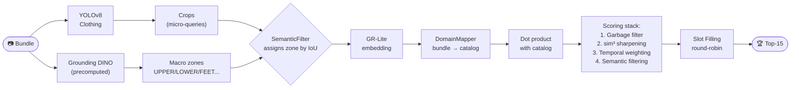
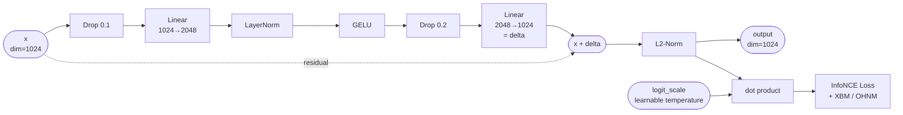

# Inditex Fashion Retrieval - HackUDC 2026 - Winning Repository

> **Zara / Inditex challenge**: Develop a solution that, starting from an image of a model, identifies the items they are wearing (e.g., a dress, heels, necklace, or handbag) and, for each one, returns the corresponding product reference from a predefined catalog.
>
> See details in [RETO.md](RETO.md), or [on the HackUDC 2026 challenge website](https://live.hackudc.gpul.org/challenges/).

---

> [!NOTE]
> This was the winning repository of the Inditex Fashion Retrieval Hackathon at HackUDC 2026. I participated as _soloVSsquad_ and achieved a final score of **71.05%** (measured as the percentage of correct lines in the submission against the ground truth).

---

| | |
|:---:|:---:|
|  |  |
|  |  |

> [!WARNING]
> **This repo was vibecoded at a hackathon, on 3 hours of sleep, over 36 hours.** The code works, but it's not production-ready. And it's not pretty. Actually, it's ugly.
>
> The git history is questionable since I had to reset it from a zip of a previous version (issues arose from accidentally committing large precomputed embedding files).
> The code structure and abstraction are questionable — almost everything is organized as scripts rather than classes, with significant code duplication. Many decisions were made at 5am. You've been warned. I'll clean it up when I can, but it works for its purpose when following the [setup](#setup) instructions.

---

## What does this do?

Given a "bundle" photo (an outfit, a street-style shot, a fashion campaign), we locate each garment and search for the 15 most similar products in the Inditex catalog. The metric is **Recall@15**.

I approached the challenge as an **Information Retrieval problem**, not a classification, generation, or heavy finetuning problem. The key question is: *how do you find, within a catalog of thousands of products, the 15 most similar ones to a garment detected in a campaign photo, **in a way that allows fast iteration**?*

This reduces to obtaining queries (garment crops) and computing embedding similarity in a vector space, but with several sources of noise to correct:

1. **Domain gap**: Bundle photos (models in campaigns) look very different from catalog product photos (white background, studio lighting). The same item produces different embeddings in each domain → the `DomainMapper` corrects this without retraining the backbone.
2. **Prediction budget distribution**: The system evaluates up to 15 products per bundle. If there are 3 garments in the outfit, the natural thing would be to give 5 predictions to each. The _Slot Filling_ round-robin distributes this evenly across all detected queries.
3. **Query quality (crop)**: Not all YOLO crops are equally useful. Some are background, irrelevant details, etc. The _garbage filter_ and global fallback serve as guardrails.

The philosophy was: **avoid heavy backbone finetuning or retraining** (which is slow and GPU-hungry) and instead **focus improvements on the intermediate logic**: better domain mapping, better negative selection during mapper training, and better distribution and interpretation of predictions.

The incremental improvements that scored the most came almost entirely from progressing the **DomainMapper** with richer contrastive learning techniques (especially negative mining). **Slot Filling** was also key to not wasting the 15-prediction budget on a single easy-to-match garment, and better garment detection with YOLOv8-Clothing was key for high-quality input queries.

---

## File map

Quick map of what each script does, since the structure is a bit chaotic. If you want to jump straight to trying it, you'll need to obtain the data (the competition data is probably not public) and structure it, then jump to [setup](#setup). For a more visual overview, check the [pipeline](#pipeline).

| File | Description |
|---|---|
| `run_submission.py` | **The main inference script.** Orchestrates the entire pipeline end-to-end: loads models, iterates over test bundles, extracts crops with YOLO, generates embeddings with GR-Lite, applies the DomainMapper, computes similarities, applies filters (temporal, semantic, garbage), and generates the submission CSV via Slot Filling (round-robin). It relies on precomputed files to iterate quickly between submissions. |
| `train_mapper.py` | **The heart of the project.** Defines and trains the `SuperDomainMapper`, a lightweight neural network that corrects the bundle→catalog domain gap. Contains the mapper architecture (residual + learnable temperature), the loss functions (InfoNCE with Hard Negative Mining, and the Cross-Batch Memory version used in the winning submission), and the full training loop with MixUp, SWA, and OneCycleLR. Iterating on this module was what had the most impact on the final score. |
| `run_gr_lite.py` | Utilities for loading the GR-Lite model (DINOv3 backbone fine-tuned for fashion) and precomputing embeddings for the entire catalog. Also works as a naive baseline (nearest neighbor without mapper) and contains `get_embeddings()`, reused by other scripts. Note: the fine-tune has no config in this repo, so weights are loaded on top of the DINOv3 config. |
| `compare_models.py` | **Slot Filling Router** script: combines detections from three models (Grounding DINO + YOLOS-Fashionpedia + YOLOv8) and routes them to semantic slots (`UPPER`, `LOWER`, `SHOES`, `DEFAULT`) using an IoU-based voting system. Was an experiment to see if combining detectors improved crops; the main pipeline ultimately uses only YOLOv8 fine-tuned on 4 Fashionpedia categories (clothing, shoes, bags, accessories). Improving this could likely improve the system a lot. |
| `semantic_filtering.py` | Defines the `SemanticFilter` class. Its responsibilities are: (1) precompute semantic catalog metadata (body zone per product from its text description: `UPPER`, `LOWER`, `FEET`, etc.), (2) assign body zones to each YOLO crop using DINO macro boxes (by IoU), and (3) apply soft (section-based penalty) and hard (contradictory body-zone zeroing) similarity filters. A good guardrail, but didn't contribute much to the score. |
| `precompute_dino.py` | Runs Grounding DINO on test bundles to detect "macro" body regions (`upper body`, `lower body`, `feet`, `head`, `bag`) and saves the results to `test_dino_macro.json`. Runs once offline because DINO is slow. The macro boxes are used by `SemanticFilter` to contextualize YOLO crops. |
| `train_lora.py` | LoRA fine-tuning of the GR-Lite backbone directly on bundle↔product pairs, with Gradient Checkpointing and Gradient Accumulation to avoid OOM on the remote GPU (an OOM mid-hackathon would have been GG). An experiment that **did not improve** results in practice: the mapper was more efficient in both time and accuracy. That said, I only trained it for 4 epochs, so iterating might help. |
| `visual_prediction_debug.py` | Visualization tool for the detection pipeline. Given a bundle, draws the YOLO crops, their assigned zones, and the top-15 most similar catalog predictions alongside the ground truth. Very useful for understanding why the model succeeds or fails in specific cases. |
| `download_images.py` | One-shot script to download all product images from the CDN URLs in the dataset CSV. Required to build the local catalog on the first run. Obviously depends on having the competition CSVs... or obtaining them by other means. |
| `prompt_dinov2.txt` | List of body zone descriptions (head, neck, shoes, top garment...) used as Grounding DINO text prompts. Lets DINO detect general body regions that YOLO then refines. |
| `requirements.txt` | Project dependencies. Typical AI stack. |
| `LICENSE.md` | Apache 2.0. |

---

## Setup

> Heads up! I've refactored the code but haven't had time to test it yet — there might be small issues, though they should be easy to fix.

```bash
python -m venv .venv && source .venv/bin/activate
pip install -r requirements.txt
# You need an HF_TOKEN in .env for GR-Lite
echo "HF_TOKEN=hf_..." > .env
```

```bash
# Precompute catalog embeddings (once)
python run_gr_lite.py

# Precompute DINO boxes for test bundles (once)
python precompute_dino.py

# Train the Domain Mapper (optional, improves results)
python train_mapper.py

# Generate submission
python run_submission.py

# To visualize predictions for a specific bundle
python visual_prediction_debug.py

# To inspect detections and slot-filling routing
python compare_models.py
```

---

## Pipeline

The pipeline follows a search-oriented design. Each bundle is a "query", each detected crop is a "sub-query", and the catalog is the "index" we search over.



### Why this design

**YOLOv8 for crops**: I decided against embedding the full bundle (which would be a very noisy query mixing multiple garments). Instead, each detected garment becomes an independent query. This improves embedding precision because GR-Lite can "focus" on a single garment at a time. The tradeoff is that the 15-prediction budget now has to be shared across multiple queries. There is still a global bundle fallback when fewer than 3 garments are detected.

**GR-Lite as backbone**: GR-Lite (DINOv3 fine-tuned for fashion by a third party) was chosen over CLIP because it generates far more discriminative embeddings for clothing — CLIP is generalist and doesn't distinguish well between, say, two black sweaters. GR-Lite embeddings capture texture, cut, color, and style with much more precision. It was literally state of the art (released about a week before the hackathon).

**DomainMapper instead of finetuning**: Fine-tuning GR-Lite fully would be expensive (1.2 GB of weights, hours per epoch on a 3090). The mapper is a two-layer network (~4M parameters) that trains in minutes and projects bundle embeddings into the catalog embedding space, closing the domain gap. It's the most important technical decision in the project.

**Why DINO for macro boxes**: YOLO detects individual garments well (micro-crops), but doesn't know whether a long sleeve is "upper body" or whether sneakers are "feet". Grounding DINO with a text prompt (`"upper body. lower body. feet. head. bag."`) identifies body regions and allows assigning a semantic zone to each YOLO crop by intersection (IoU).

**Scoring stack**: Raw cosine similarity isn't perfect. In theory, the cube (`sim^3`) amplifies the gap between a confident top-1 and mediocre candidates, though this had little impact in my experiments. Temporal weighting, on the other hand, added a solid 2–3 recall points (thanks to Sergio from GoofyTex for the tip) — it exploits the fact that Inditex CDN URLs contain a timestamp (`ts=`) correlated with the collection, and garments from the same collection are more likely to appear together in a bundle. Semantic filtering prevents a shoe crop from returning T-shirts.

**Slot Filling (round-robin)**: Instead of giving the 15 top results from the most confident query (which could be 15 variants of the same easy product), we take one prediction at a time from each crop in rotation. So if there are 4 garments, the 15 final predictions are distributed across all of them. This avoids wasting the Recall@15 budget. The downside is that if a garment isn't the most obvious one by similarity and there are many detections, it might not get a chance to appear.

This is the neural network architecture of the SuperDomainMapper:



---

## Techniques implemented

### 🔍 Garment detection

- **YOLOv8-Clothing** (`kesimeg/yolov8n-clothing-detection`): main crop detector. Each crop acts as an independent search query. Used without additional NMS to avoid losing valid detections in overlapping cases. Adding NMS and confidence filters could be explored, but my tests showed no significant improvement.
- **Global image fallback**: if YOLO detects fewer than 3 garments (e.g., blurry or atypical image), the full bundle is added as an extra query for coverage.
- **Grounding DINO** (precomputed offline in `test_dino_macro.json`): detects macro body regions using a text prompt. Not used directly in inference (too slow); precomputed once.

### 🧠 Embeddings & Domain Mapping

- **GR-Lite** (Meta's DINOv3 backbone, fine-tuned for fashion): visual feature extractor. Generates 1024-dimensional embeddings. Far better than CLIP for fine-grained clothing.
- **SuperDomainMapper** (`train_mapper.py`): two-layer residual neural network with a learnable temperature (CLIP/SigLIP style). Projects bundle embeddings into the catalog embedding space. Architecture: `Dropout(0.1) → Linear(1024, 2048) → LayerNorm → GELU → Dropout(0.2) → Linear(2048, 1024) + skip connection + L2-normalize`. Started simpler and was iteratively refined.
  - **Learnable temperature**: automatically learns the logit scale factor, eliminating a critical hyperparameter.
  - **Online Hard Negative Mining (OHNM)**: in the InfoNCE loss, instead of using all batch negatives, only the top-15% hardest ones are selected. Forces the model to learn fine-grained distinctions between similar products.
  - **Cross-Batch Memory (XBM)**: FIFO bank of 8192 product embeddings from previous batches. Expands the effective negative pool from ~511 (batch) to ~8703 without extra VRAM cost. In more detail: it stores product embeddings from past batches and uses them as negatives in the loss. How does it know they're negatives? Because they're not the product being searched for. And if they happen to be very similar, even better — the model has to learn to distinguish them. **This was the technique with the highest impact on the final score** — the definitive push to 71%.
  - **Embedding MixUp**: pairs of embeddings are mixed (α=0.2, 30% probability) to regularize the space and make it more "traversable", avoiding empty zones and improving generalization.
  - **Label Smoothing** (in XBM loss): replaces hard labels [0,1] with soft distributions, preventing the model from collapsing on noisy pseudo-labels.
  - **OneCycleLR**: scheduler with automatic warmup (first 10%) and cosine annealing. Stabilizes training and allows higher learning rates.
  - **Stochastic Weight Averaging (SWA)**: averages the weights from the last 20% of epochs, smoothing the loss landscape and improving generalization.

### 🔎 Search & scoring

- **Similarity sharpening** (`sim^3`): cubing similarities amplifies the gap between confident and mediocre candidates. Safe because normalized embeddings have positive similarities in practice, so cubing doesn't flip signs. Had little impact in practice — kept it as a late-stage idea.
- **Garbage filter**: if the maximum similarity of a crop against the entire catalog is < 0.20, the crop is discarded. Filters background crops, non-clothing elements (lampposts, floors), or overly noisy images.
- **Temporal Proximity Weighting**: Inditex CDN URLs contain a timestamp (`ts=`) indicating the collection. A Gaussian decay (σ ≈ 1 month) is applied to the temporal difference between the bundle and each product. Temporally close garments receive a bonus, others a penalty. Surprisingly important for the final score — feels a little like cheating, but hey.
- **Alpha Query Expansion (AQE / α-QE)**: refines the query embedding by averaging it with its K nearest neighbors in the catalog before the final search. Pulls the query toward the center of the correct cluster. Implemented but **did not improve** consistently in practice — not used in the final submission.

### 🗺️ Semantic filtering

- **Semantic Filtering** (`semantic_filtering.py`): two types of filters applied to raw similarities:
  - *Soft filter (× 0.7)*: if the product and bundle belong to different sections (e.g., a "kids" product in a "women" bundle), penalize the similarity.
  - *Hard filter (× 0.0)*: if the body zone of the crop (UPPER, LOWER, FEET…) directly contradicts the body zone of the product (e.g., a shoe crop retrieving T-shirts), zero it out completely.

### 🔬 LoRA fine-tuning (experiment)

- `train_lora.py`: fine-tunes the GR-Lite backbone with LoRA + Gradient Checkpointing + Gradient Accumulation. **Did not conclusively improve** over the DomainMapper with XBM: training time was much longer and pre-existing catalog embeddings become invalid (they need to be recomputed). Not worth it during a hackathon.

---

## Technique impact on score

Improvements accumulated iteratively. Here's my estimated relative impact of each technique, from highest to lowest:

| Technique | Estimated impact | Notes |
|---|---|---|
| **Basic DomainMapper** (InfoNCE) | ⭐⭐⭐⭐⭐ | Biggest baseline jump. Without the mapper the score is ~40–50%. |
| **Cross-Batch Memory (XBM)** | ⭐⭐⭐⭐ | The definitive push. Going from OHNM to XBM was the final step to 71%. |
| **Online Hard Negative Mining** | ⭐⭐⭐ | Significant improvement over naive InfoNCE. Foundation for XBM. Hyperparameter tuning was important. |
| **Slot Filling (round-robin)** | ⭐⭐⭐ | Avoids wasting the budget of 15 on a single garment. First big score jump. |
| **Temporal Proximity Weighting** | ⭐⭐ | Moderate boost; depends on how many bundles/products have timestamps. |
| **Semantic Filtering** | ⭐⭐ | Useful guardrail. Prevents obvious mistakes (shoes → T-shirts). |
| **MixUp + Label Smoothing** | ⭐⭐ | Regularization. Improves generalization; hard to isolate exact impact. |
| **SWA** | ⭐ | Small generalization improvement at the end of training. |
| **Garbage filter / sim sharpening** | ⭐ | Noise cleanup. Marginal but consistent. |
| **Alpha Query Expansion (AQE)** | ✗ | Did not improve in practice. Discarded. |
| **LoRA fine-tuning** | ✗ | Expensive in time. Did not beat mapper + XBM. |

---

## License

Apache 2.0 — see [LICENSE.md](../LICENSE.md). Open source, use it however you want.
Contributions, issues, forks, and pull requests are welcome!

---

    ~ usbt0p a.k.a soloVSsquad thanks: ☕, GoofyTex, GPUL, Google Antigravity, and everyone who made this epic hackathon possible


